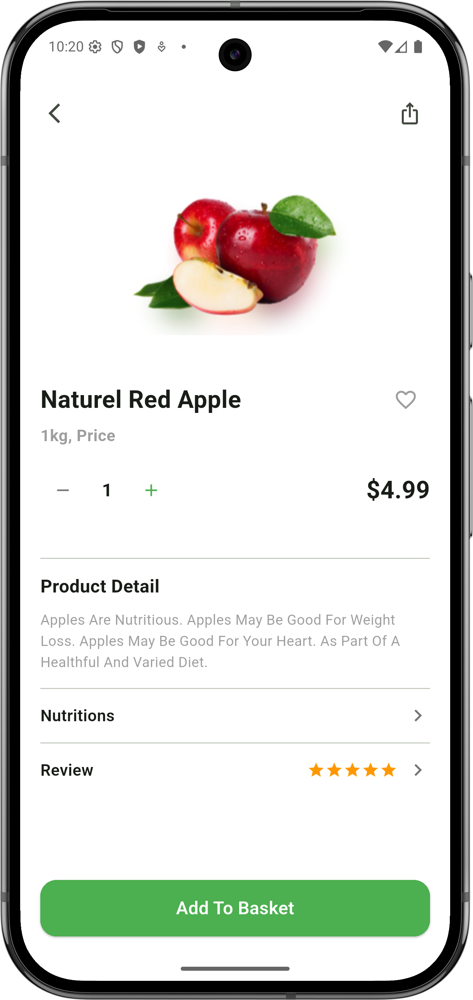

# Product Detail Screen

A Flutter product detail screen implementation showcasing a clean and modern e-commerce UI.

## Screenshot



## Features

- **Product Display**: High-quality product image with natural red apple
- **Interactive Elements**: 
  - Favorite button to toggle product wishlist status
  - Quantity counter with increment/decrement controls
  - Share functionality
- **Product Information**:
  - Product name and weight details
  - Dynamic pricing display
  - Comprehensive product description
- **Navigation Sections**:
  - Nutritions information with chevron navigation
  - Review section with 5-star rating display
- **Call to Action**: Full-width "Add to Basket" button

## Implementation Details

- **State Management**: Uses StatefulWidget for managing quantity and favorite state
- **Responsive Layout**: SafeArea with scrollable content and fixed bottom button
- **Material Design**: Clean UI following Material Design 3 guidelines
- **Asset Integration**: Local image assets for product display

## Getting Started

### Prerequisites
- Flutter SDK (^3.10.3)
- Dart SDK

### Installation

1. Clone the repository
2. Navigate to the project directory:
   ```bash
   cd product_detail_screen
   ```
3. Install dependencies:
   ```bash
   flutter pub get
   ```
4. Run the app:
   ```bash
   flutter run
   ```

## Assets

Make sure the following assets are available:
- `assets/apple.png` - Product image

## Project Structure

```
lib/
  └── main.dart          # Main application file with ProductDetailScreen
assets/
  ├── apple.png          # Product image
  └── task_screenshot.png # UI reference screenshot
```
