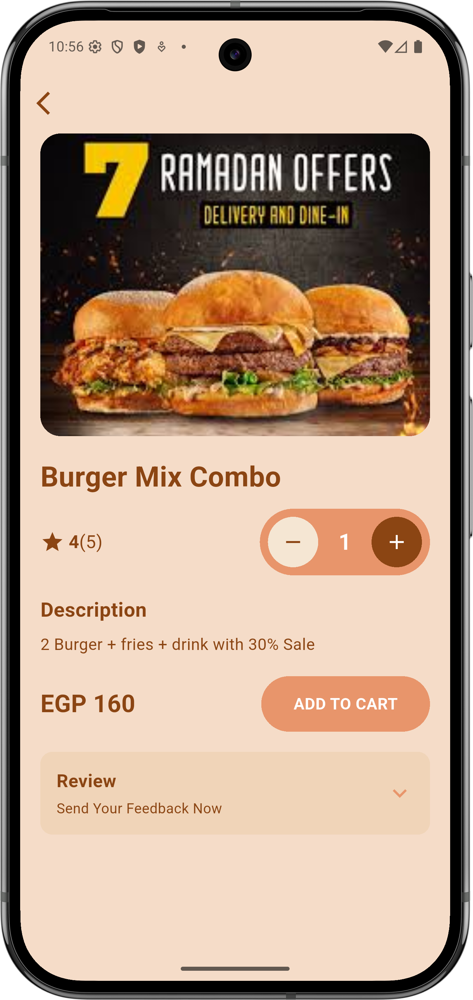

# burger_screen

A Flutter burger product detail screen UI showcasing a Burger Mix Combo with quantity controls and add to cart functionality.

## Screenshot



## Features

- **Product Image Display**: Full-width rounded image showcasing the burger
- **Product Title**: "Burger Mix Combo" displayed prominently
- **Rating System**: Star rating with review count (4 stars with 5 reviews)
- **Quantity Selector**: Custom-designed quantity controls with:
  - Cream-colored minus button
  - Display counter in the center
  - Brown-colored plus button
- **Product Description**: Details about the combo offer
- **Price Display**: Shows product price in EGP
- **Add to Cart Button**: Custom-styled button with coral/orange color
- **Review Section**: Expandable section for customer feedback

## UI Components

### Colors Used
- Background: `#F5DCC8` (Light beige/tan)
- Primary Text: `#8B4513` (Saddle brown)
- Accent Color: `#E8956B` (Coral/orange)
- Button Background: `#E8956B`
- Minus Button: `#F5E6D3` (Cream)
- Plus Button: `#8B4513` (Dark brown)
- Review Section: `#F0D4B8` (Light tan)

### Layout Structure
- **StatelessWidget**: Pure UI implementation without state management
- **SafeArea**: Ensures content stays within visible screen boundaries
- **Column Layout**: Vertical arrangement of components
- **ScrollView**: Allows content to scroll if it exceeds screen height
- **Custom Containers**: Styled circular buttons and rounded rectangles

## Code Structure

```
lib/
└── main.dart
    ├── MyApp (Root widget with theme configuration)
    └── BurgerDetailScreen (Main UI screen)
        ├── Back button
        ├── Product image
        ├── Product details section
        │   ├── Title
        │   ├── Rating & Quantity controls
        │   ├── Description
        │   ├── Price & Add to Cart button
        │   └── Review section
        └── ScrollView wrapper
```

## Assets Required

- `assets/burger_offer.jpeg` - Product image

Make sure to add the assets folder in `pubspec.yaml`:

```yaml
flutter:
  assets:
    - assets/burger_offer.jpeg
```

## Getting Started

This project is a starting point for a Flutter application.

### Running the App

```bash
cd flutter/session_7/task_2/burger_screen
flutter pub get
flutter run
```
