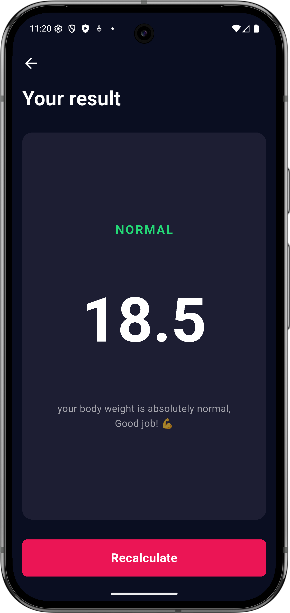

# BMI Calculator App

A modern Flutter BMI (Body Mass Index) calculator app with a clean dark theme UI. This app demonstrates best practices in Flutter development with reusable widgets, organized code structure, and smooth navigation.

## Features

- **BMI Input Screen**: 
  - Gender selection (Male/Female)
  - Height slider (120-220 cm)
  - Weight and age counter with increment/decrement buttons
  - Calculate button to compute BMI

- **Result Screen**:
  - Display BMI value
  - Show BMI status (Normal, Overweight, etc.)
  - Descriptive message
  - Recalculate button to go back

- **Modern UI**:
  - Dark theme with pink accent colors
  - Smooth animations and interactions
  - Responsive layout
  - Custom styled components

## Project Structure

```
lib/
├── main.dart                 # App entry point
├── core/                     # Core configuration
│   ├── colors.dart          # Color constants
│   ├── text_styles.dart     # Text style definitions
│   └── constants.dart       # Dimension and value constants
├── screens/                  # Screen widgets
│   ├── bmi_screen.dart      # BMI input screen
│   └── result_screen.dart   # Result display screen
└── widgets/                  # Reusable widgets
    ├── app_logo.dart        # Logo component
    ├── custom_button.dart   # Generic button
    ├── custom_card.dart     # Generic card container
    ├── custom_slider.dart   # Generic slider with label
    ├── label_value_text.dart # Label + value text pair
    ├── gender_card.dart     # Gender selection card
    ├── counter_card.dart    # Counter with +/- buttons
    ├── circle_button.dart   # Circular icon button
    └── result_card.dart     # BMI result display card
```

## Architecture

The app follows a clean architecture pattern with:

- **Core Module**: Centralized constants for colors, text styles, and dimensions
- **Screens**: Top-level screen widgets
- **Reusable Widgets**: Highly parameterized components that can be used throughout the app
- **UI-Only Implementation**: No state management (StatelessWidgets)

## Color Scheme

- **Background**: `#0A0E21` (Dark Navy)
- **Card Background**: `#1D1E33` (Dark Blue)
- **Primary Accent**: `#EB1555` (Pink/Red)
- **Button Background**: `#4C4F5E` (Gray)
- **Text**: White with opacity variations

## Reusable Widgets

All widgets are designed to be highly reusable with customizable parameters:

### CustomButton
```dart
CustomButton(
  text: 'Calculate',
  onPressed: () {},
  backgroundColor: AppColors.primaryPink,
  height: 60,
)
```

### CustomSlider
```dart
CustomSlider(
  label: 'Height',
  value: 180,
  unit: 'cm',
  min: 120,
  max: 220,
  onChanged: (value) {},
)
```

### CounterCard
```dart
CounterCard(
  label: 'weight',
  value: 50,
  onIncrement: () {},
  onDecrement: () {},
)
```

### GenderCard
```dart
GenderCard(
  icon: Icons.male,
  label: 'male',
  isSelected: true,
  onTap: () {},
)
```

## Navigation

The app uses Flutter's built-in navigation:
- BMI Screen → Result Screen via `Navigator.push()`
- Result Screen → BMI Screen via `Navigator.pop()`

## Getting Started

### Prerequisites
- Flutter SDK (3.10.3 or higher)
- Dart SDK
- Android Studio / VS Code with Flutter plugins

### Installation

1. Clone the repository:
```bash
git clone <repository-url>
cd bmi_app
```

2. Install dependencies:
```bash
flutter pub get
```

3. Run the app:
```bash
flutter run
```

## Usage

1. Select your gender (Male/Female)
2. Adjust height using the slider
3. Set weight and age using +/- buttons
4. Press "Calculate" to see your BMI result
5. Press "Recalculate" or back arrow to return

## Customization

The app is highly customizable through the core constants:

- **Colors**: Edit `lib/core/colors.dart`
- **Text Styles**: Edit `lib/core/text_styles.dart`
- **Dimensions**: Edit `lib/core/constants.dart`

## Screenshots

<div align="center">
  
  
</div>

| BMI Input Screen | Results Screen |
|:----------------:|:--------------:|
| Enter your details | View your BMI result |

## Future Enhancements

- [ ] Add state management (Provider/Bloc)
- [ ] Calculate actual BMI based on inputs
- [ ] BMI history tracking
- [ ] Different BMI categories (Underweight, Normal, Overweight, Obese)
- [ ] BMI chart visualization
- [ ] Save and load user data
- [ ] Localization support

## License

This project is created for educational purposes.

## Resources

- [Flutter Documentation](https://docs.flutter.dev/)
- [Dart Documentation](https://dart.dev/guides)
- [Material Design](https://material.io/design)
